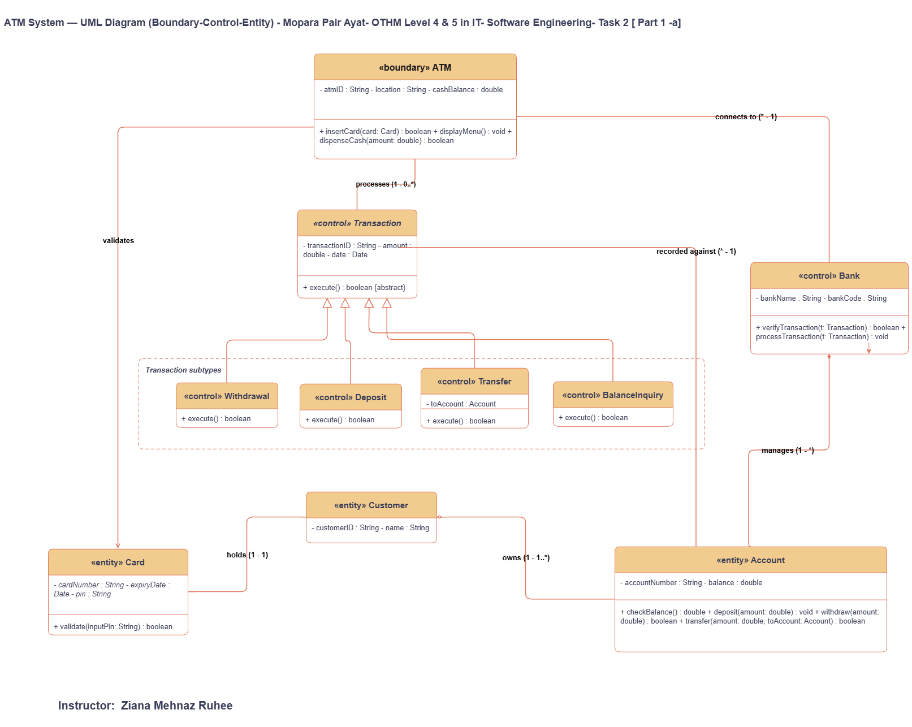
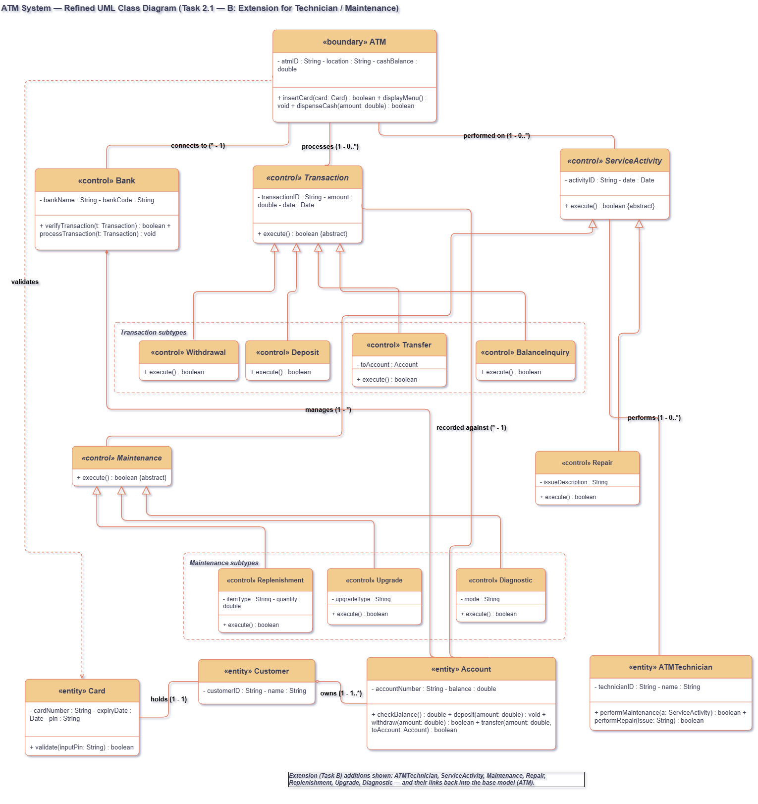

<div align="center">

# BITHM National Bank — Realistic ATM Simulator

**Interactive Java Swing ATM Kiosk • Boundary–Control–Entity UML Implementation**

  <p align="center">
    
  </p>

  <p align="center">
    
    
    
    
  </p>

  <p align="center">
    <a href="#-features"></a>
    <a href="#-uml--oop-design"></a>
    <a href="#-demo-accounts"></a>
    <a href="#-getting-started"></a>
  </p>

  

</div>

---

<div align="center">

<a id="academic-submission"></a>

## 📜 Academic Submission & Course Dossier

<p align="center">
  
</p>

<p align="center">
  
  
</p>

<p align="center">
  
  
  
</p>

| ⚜️ Specification | 🏆 Project Record |
| :--- | :--- |
| **Project** | `BITHM National Bank ATM Simulator` |
| **Student Name** | `Mopara Pair Ayat` &nbsp;&nbsp; 🌟 *Primary Developer* |
| **Course Instructor** | `Ziana Mehnaz Ruhee` &nbsp;&nbsp; 🎓 *Project Evaluator & Mentor* |
| **Educational Institute** | **BITHM College Of Professionals** &nbsp;&nbsp; 🏫 *Affiliated Campus* |
| **Qualification Level** | `OTHM Level 5 in IT/CSE` &nbsp;&nbsp; 🇬🇧 *UK Regulated Framework* |
| **Subject Name** | `Software Engineering` &nbsp;&nbsp; 💻 *Core Computer Science Unit* |
| **Coursework** | `Task 1, Part 1-c` — ATM System UML implementation |

</div>

---

## 📦 Overview

This project transforms an ATM UML class diagram into a working Java desktop application. It combines core banking operations with a physical ATM-style interface: card insertion, PIN authentication, cash dispensing and collection, deposit intake, receipt printing, keypad input, and ATM-style sound feedback.

It is an academic software simulation. No physical bank hardware or live banking network is connected.

---

## 🎯 Features

<a id="features"></a>

- 🏧 **Realistic ATM Kiosk UI** — visual card reader, secure keypad, cash dispenser, receipt printer, status LEDs, and BITHM bank branding.
- 💳 **Interactive Card Journey** — choose a demo card, animate insertion, authenticate with a four-digit PIN, and eject the card at the end of the session.
- 🔐 **Secure PIN Handling** — keypad input, clear button, confirmation, warning sound, and three-attempt lockout behaviour.
- 💸 **Customer Transactions** — balance inquiry, cash withdrawal, cash deposit, fund transfer, and mini statement.
- 💵 **Physical Cash Simulation** — note counting, shutter opening, amount-aware note stack, and cash collection flow.
- 🧾 **Receipt Simulation** — receipt choice, printer animation, and collection flow.
- 🛠️ **Technician Console** — replenishment, upgrade, diagnostics, and repair actions using the maintenance class model.
- 🔊 **Generated Sound Effects** — programmatic reader, keypad, cash-dispenser, receipt-printer, confirmation, and warning tones; no external audio files required.

---

## 🏛️ UML & OOP Design

<a id="uml--oop-design"></a>

The application is organised around the **Boundary–Control–Entity** model from the supplied UML diagrams.

### Base ATM UML Class Diagram

<p align="center">
  
</p>

### Refined UML Class Diagram

<p align="center">
  
</p>

| Layer | Implemented classes |
| :--- | :--- |
| **Boundary** | `ATM` |
| **Control** | `Bank`, `Transaction`, `Withdrawal`, `Deposit`, `Transfer`, `BalanceInquiry` |
| **Service control** | `ServiceActivity`, `Maintenance`, `Replenishment`, `Upgrade`, `Diagnostic`, `Repair` |
| **Entity** | `Card`, `Customer`, `Account`, `ATMTechnician` |
| **Presentation** | `ATMGui`, `SoundEffects`, `Main` |

### Key relationships

```text
Customer ── holds ──> Card
Customer ── owns ──> Account
Bank ── manages ──> Account
ATM ── connects to ──> Bank
ATM ── validates ──> Card
Transaction ── recorded against ──> Account
ATMTechnician ── performs ──> ServiceActivity
```

---

## 👤 Demo Accounts

<a id="demo-accounts"></a>

Choose a card from the simulator welcome screen, then use the associated PIN.

| Customer | Card number | PIN | Available accounts |
| :--- | :--- | :---: | :--- |
| **Ziana Mehnaz Ruhee** | `1111-2222-3333-4444` | `1234` | `ACC-1001` savings, `ACC-1002` current |
| **Mopara Pair Ayat** | `5555-6666-7777-8888` | `4321` | `ACC-2001` savings |

Technician access is available from the welcome screen. The configured demo technician is **Mopara Pair Ayat**.

---

## 🧭 ATM Transaction Flow

```text
Choose demo card → Insert card → Enter PIN → Select transaction
→ Process transaction → Collect cash / confirm deposit
→ Optional receipt → Take card
```

---

## ⚙️ Getting Started

<a id="getting-started"></a>

### Requirements

- **JDK:** version 11 or later
- **Platform:** Windows, macOS, or Linux desktop with Java Swing support

### Compile and run

```powershell
javac -d bin src/atm/*.java
java -cp bin atm.Main
```

> `bin/` is generated at compile time and intentionally excluded from version control.

---

## 📁 Project Structure

```text
src/
└── atm/
    ├── Main.java               Application entry point and seeded demo data
    ├── ATMGui.java             ATM kiosk interface, transactions, and animations
    ├── SoundEffects.java       Generated ATM-style audio effects
    ├── ATM.java                ATM boundary model
    ├── Bank.java               Bank transaction control
    ├── Transaction.java        Abstract transaction base class
    ├── Withdrawal.java         Cash withdrawal transaction
    ├── Deposit.java            Cash deposit transaction
    ├── Transfer.java           Account transfer transaction
    ├── BalanceInquiry.java     Balance inquiry transaction
    ├── Card.java               Card entity and PIN validation
    ├── Customer.java           Customer entity
    ├── Account.java            Account entity and balance operations
    ├── ATMTechnician.java      Technician entity
    ├── ServiceActivity.java    Abstract service activity
    ├── Maintenance.java        Abstract maintenance activity
    ├── Replenishment.java
    ├── Upgrade.java
    ├── Diagnostic.java
    └── Repair.java
```

---

## 🧪 Validation

```powershell
javac -d bin src/atm/*.java
```

The project has been checked for:

- Valid and invalid PIN authentication, including three-attempt lockout
- Balance inquiry, deposit, withdrawal, and transfer paths
- Invalid input, insufficient account balance, and insufficient ATM cash
- Card, cash, receipt, and deposit animation flows
- Technician maintenance and repair actions

---

## 📄 Scope & License

This project is provided for academic demonstration purposes. It simulates ATM hardware and does not connect to a real banking service, card reader, cash dispenser, or printer.

<div align="center">

  

<sub>Built with Java, UML-driven OOP design, and BITHM National Bank ATM simulation.</sub>

</div>
